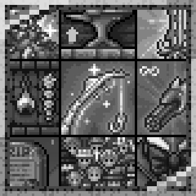



<h3>更差的体验</h3>

[English](README-en.md) | 简体中文

[更新日志](ChangeLog.md)\

## 📖 简介

**更差的体验** 是一个为 Terraria 游戏体验进行优化的模组，旨在提供更好的游戏体验？

## ✨ 功能

绝大多数功能都在 **模组配置** 中可见，具体还请在游戏中查看。

1. 物品最大堆叠等辅助模组普遍功能？
2. 玩家的血量，魔力，防御大大提升？
3. 一大堆有的没有的功能等着你来开启！！！

> 几乎所有功能都是 **可以调节** 的，自行选择适合你的功能！

> 推荐 **IDE**：Rider、Visual Studio 2026、Visual Studio Code

1. 使用 **IDE** 打开项目
2. 使用 **IDE** 编译项目（通常使用快捷键 `F5` 可快速启动）

## 📗 版权声明

想用就用，我想没什么人会去用。

附:\
本模组开源链接: <https://github.com/bilimoing/WorstGame>\
更好的体验开源链接<https://github.com/487666123/ImproveGame>\